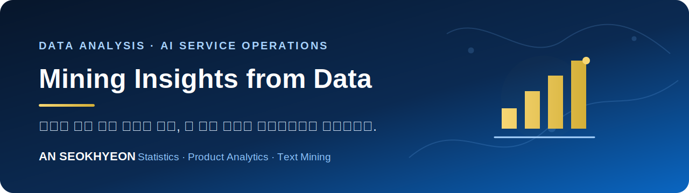
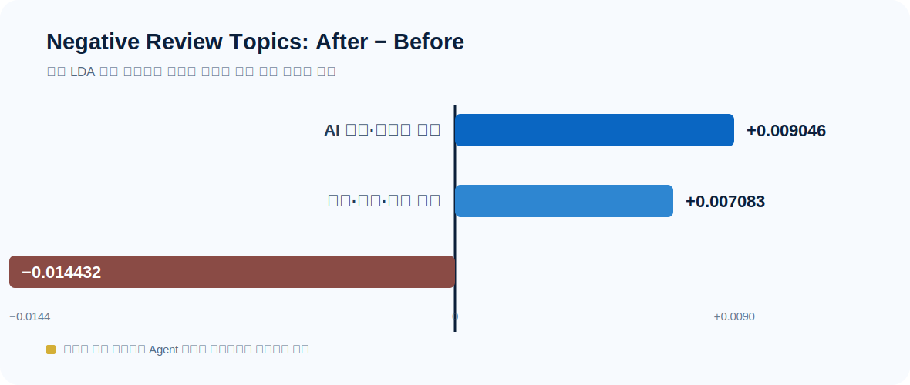

  

# AN Seokhyeon | Data Analysis Portfolio

통계학을 전공하며 **사용자의 선택·행동·인식 데이터**를 분석해 왔습니다.  
분석 결과를 숫자에서 끝내지 않고, **서비스 개선과 운영 의사결정**으로 연결하는 데이터 분석가를 지향합니다.

---

## 🔎 Focus

- **Service / Product Analytics:** 사용자의 선택과 행동을 설명하고 개선 기회 탐색
- **AI Service Operations / AX:** AI 서비스 변화에 따른 사용자 인식과 운영 이슈 분석
- **Text & BI Analytics:** 비정형 텍스트를 구조화하고 핵심 결과를 시각적으로 전달

## 🚀 Featured Project

### AI Agent 출시 전후 ChatGPT 사용자 인식 변화 분석

> Google Play Store USA 앱 리뷰를 바탕으로 ChatGPT Agent 출시 전후의 사용자 인식 변화를 비교한 텍스트마이닝 연구

| Problem | Approach | Evidence | Service Value |
|---|---|---|---|
| 기능 출시 이후 사용자의 관심과 불만은 어떻게 달라졌는가? | VADER 감성 분류 → 감성별 통합 LDA → 하위 LDA | 최종 리뷰 **269,606건**, 출시 전 **149,912건**, 출시 후 **119,694건** | 신뢰·메모리, 구독·사용 제한, 접근 문제를 운영 모니터링 항목으로 구조화 |

부정 리뷰에서는 출시 후 **AI 불신·메모리 한계(+0.009046)**와 **구독·비용·사용 제한(+0.007083)** 토픽의 비중이 증가했고, **접근·로그인 문제(-0.014432)**는 감소했습니다. 이 결과는 인과효과가 아니라 같은 토픽 공간에서 관찰한 전후 비중 차이입니다.

[**프로젝트 상세 보기 →**](projects/ai-agent-user-perception/README.md) ·
[분석 노트북](projects/ai-agent-user-perception/notebooks/01_full_analysis.ipynb) ·
[검증 결과표](projects/ai-agent-user-perception/outputs/README.md) ·
[방법론](projects/ai-agent-user-perception/docs/methodology.md)

  

## 🧰 Skills in Context

- **Analysis:** Python, pandas, NumPy, 통계 기반 전처리·분석 설계
- **Text Mining:** VADER, LDA, 토픽 변화 비교, 대표 문서 기반 토픽 해석
- **Visualization:** Matplotlib, Seaborn, Tableau
- **Workflow:** Jupyter Notebook, Git/GitHub 학습 및 재현 가능한 분석 구조화
- **Credential:** ADsP

AI는 코드 작성·오류 수정·최적화·시각화와 해석 초안의 보조 도구로 활용합니다. 분석 순서, 데이터 정제 기준, 방법론 선택, 토픽 검토와 최종 해석은 직접 판단하고 검증합니다.

## 📌 Portfolio Status

현재는 가장 자신 있는 AI Agent 사용자 인식 연구부터 공개 기준에 맞춰 정리했습니다. 다른 프로젝트는 코드·데이터 공개 범위와 결과 수치를 다시 검증한 뒤 순차적으로 추가할 예정입니다.

## ✉️ Contact

- **Email:** [iam10081cm@gmail.com](mailto:iam10081cm@gmail.com)
- **GitHub:** [github.com/AnSeokHyeon1212](https://github.com/AnSeokHyeon1212)

