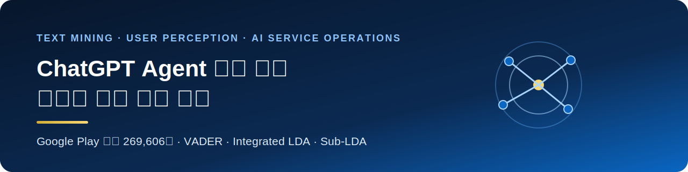
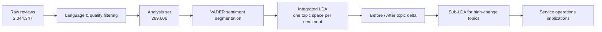
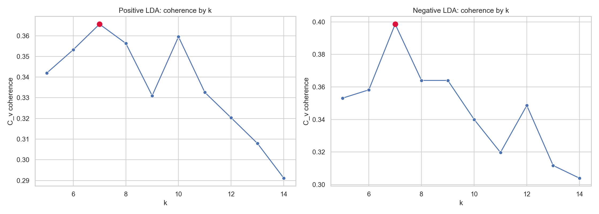
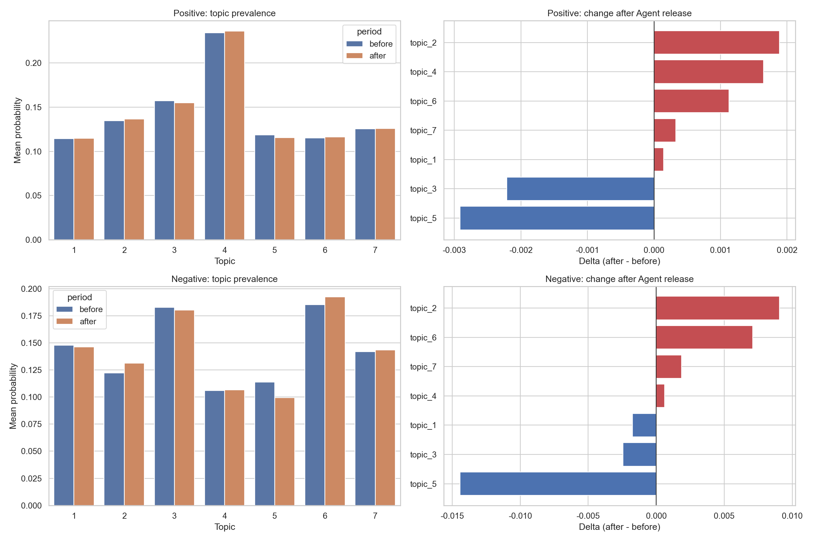
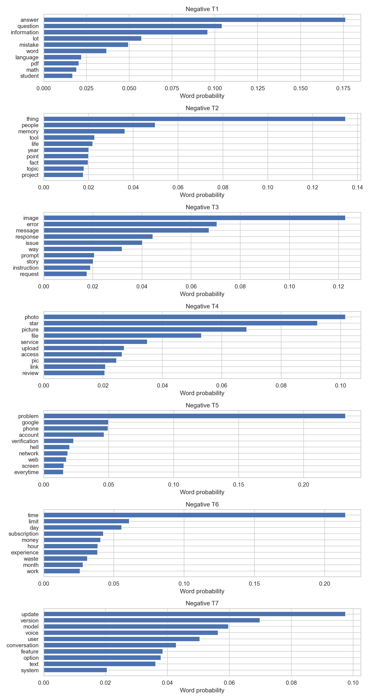
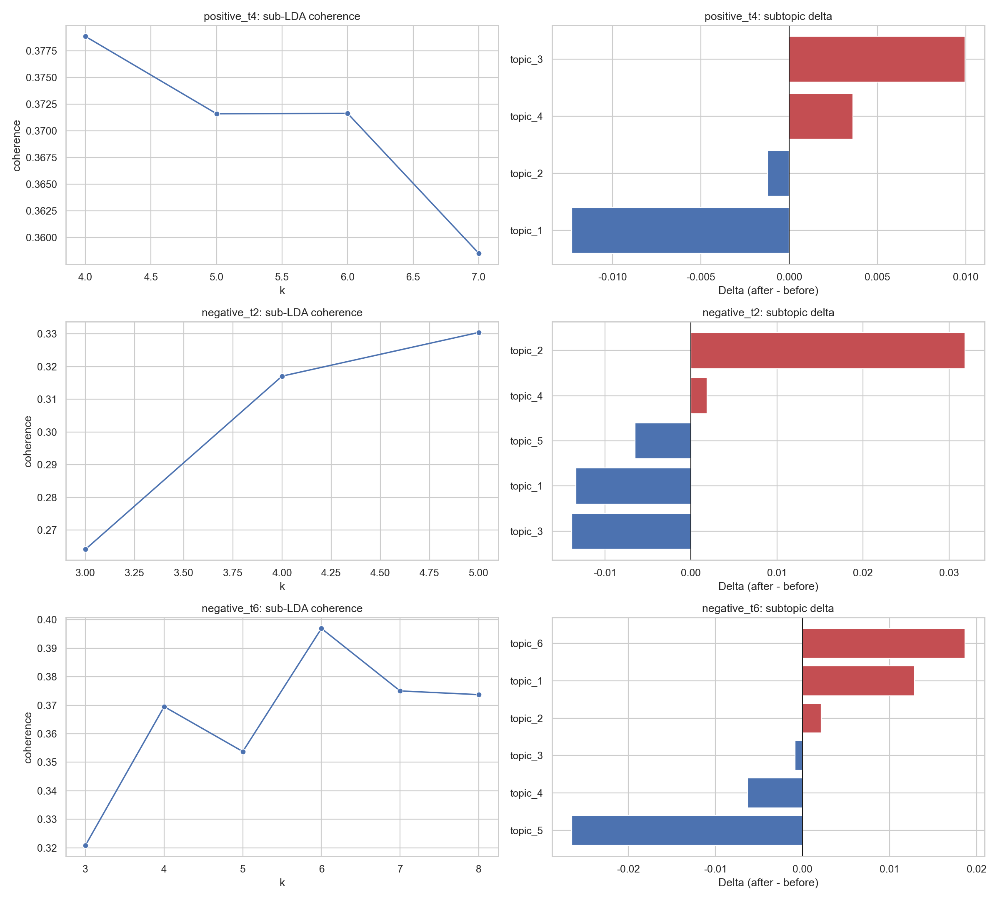

<div align="center">
  
</div>

# AI Agent 출시 전후 ChatGPT 사용자 인식 변화 분석

> Google Play Store USA 앱 리뷰 **269,606건**을 분석해 Agent 출시 전후 사용자가 말하는 문제의 구조와 비중 변화를 탐색했습니다.

[포트폴리오 홈](../../README.md) ·
[노트북](notebooks/01_full_analysis.ipynb) ·
[검증 결과표](outputs/README.md) ·
[방법론](docs/methodology.md) ·
[한계와 윤리](docs/limitations-and-ethics.md)

## 🔎 Project Overview

| 항목 | 내용 |
|---|---|
| 연구 질문 | Agent 출시 전후 ChatGPT 사용자의 인식과 불만 토픽은 어떻게 달라졌는가? |
| 데이터 | Google Play Store USA ChatGPT 앱 리뷰 |
| 수집 기간 | 2023-07-26 ~ 2026-04-02 |
| 비교 기준일 | 2025-07-17, 기준일 리뷰는 전후 비교에서 제외 |
| 최종 분석 규모 | 269,606건 — 출시 전 149,912건 / 출시 후 119,694건 |
| 분석 방법 | 언어·품질 필터링, VADER, 감성별 통합 LDA, 하위 LDA |
| 결과물 | 분석 노트북, 검증 결과 CSV, 시각화, 학회 발표 자료 |
| 발표 | 2026 한국경영정보학회 |

## 🎯 Problem

기능 출시 전후의 평점 평균만 비교하면 **사용자가 무엇을 좋아하거나 불편해하는지** 알기 어렵습니다. 리뷰 텍스트를 공통 토픽 공간에서 비교해 다음 질문에 답하고자 했습니다.

1. 출시 전후 리뷰의 감성 구성은 어떻게 달라졌는가?
2. 같은 불만 범주 안에서 어떤 토픽의 비중이 커지거나 작아졌는가?
3. 변화가 큰 토픽을 더 세분화하면 어떤 운영 이슈가 드러나는가?

## 🗂️ Data

| 처리 단계 | 리뷰 수 | 비고 |
|---|---:|---|
| 원시 누적 리뷰 | 2,044,347 | 사용자 이름은 분석 데이터에서 제거 |
| 영어 리뷰 | 929,086 | 언어 탐지와 문자 비율 기준 적용 |
| 최종 분석 리뷰 | 269,606 | 중복·저정보·품질 기준 적용 |
| 긍정 | 195,720 | VADER compound ≥ 0.20 |
| 중립 | 36,318 | -0.20 < compound < 0.20 |
| 부정 | 37,568 | VADER compound ≤ -0.20 |

원본 리뷰는 개인정보와 재배포 범위를 고려해 저장소에 포함하지 않습니다. 준비 방법과 필요한 열은 [data/README.md](data/README.md)에 정리했습니다.

## 🧪 Approach



- **VADER:** 감성 모델 성능 경쟁이 목적이 아니라 토픽 분석 전 감성 집단을 나누는 단계이므로, 해석이 명확한 사전 기반 방법을 선택했습니다.
- **통합 LDA:** 출시 전·후 모델을 따로 학습하면 토픽 번호가 직접 대응하지 않습니다. 감성별로 전후 문서를 합쳐 하나의 모델을 학습한 뒤 기간별 평균 토픽 확률을 비교했습니다.
- **토픽 수:** `k=5~14`의 coherence와 대표 문서 해석 가능성을 함께 검토했고, 긍정·부정 모두 `k=7`을 사용했습니다.
- **하위 LDA:** 변화 폭이 큰 부정 토픽을 다시 나눠 상위 토픽 안의 세부 이슈를 확인했습니다.

세부 기준은 [방법론 문서](docs/methodology.md)에서 확인할 수 있습니다.

## 📊 Key Results

<div align="center">
  
</div>

### Main LDA — 부정 리뷰 토픽 변화

| 토픽 해석 | 출시 후 변화량 | 해석 |
|---|---:|---|
| AI 불신·메모리 한계 | **+0.009046** | 응답 신뢰성과 대화 기억에 관한 불만 비중 증가 |
| 구독·비용·사용 제한 | **+0.007083** | 가격, 결제, 사용량 제한 관련 불만 비중 증가 |
| 접근·로그인 문제 | **-0.014432** | 계정 접근과 로그인 관련 불만 비중 감소 |

### Sub-LDA — 구독·비용·사용 제한 토픽 세분화

| 하위 토픽 해석 | 출시 후 변화량 |
|---|---:|
| 기업 윤리·군사 계약 비판 | **+0.018656** |
| 구독 사기·결제 불신 | **+0.012864** |
| 시간 낭비 경험 | **-0.026490** |

수치는 토픽 확률의 기간별 평균 차이인 `after - before`입니다. 전체 결과와 coherence는 [outputs/](outputs/README.md)에 공개했습니다.

<details>
<summary><strong>Technical visualizations 펼쳐보기</strong></summary>

### Topic count selection



### Main topic comparison



### Negative topic keywords



### Sub-topic selection and delta



</details>

## 💡 Insights & Recommendations

- **신뢰·메모리 모니터링:** 모델 업데이트 이후 기억 실패, 일관성 저하, 오답 신뢰 문제를 별도 VOC 태그로 추적합니다.
- **구독 경험 분리 측정:** 가격 불만, 결제 오류, 사용량 제한, 환불·사기 인식을 하나의 “구독 불만”으로 합치지 않고 운영 지표를 분리합니다.
- **릴리스 전후 VOC 대시보드:** 주요 출시일을 기준으로 토픽 비중과 대표 리뷰를 주 단위로 관찰해 급격한 변화를 조기에 확인합니다.
- **접근 문제의 감소 원인 검증:** 감소한 토픽도 해결로 단정하지 않고 로그인 성공률, 문의량 같은 행동·운영 지표와 함께 확인합니다.

## ⚠️ Limitations

- 전후 비교는 **관찰적 변화**이며 Agent 출시의 인과효과를 증명하지 않습니다.
- 통계적 유의성 검정을 수행하지 않아 변화량의 불확실성을 별도로 제시하지 못했습니다.
- Google Play Store USA의 영어 리뷰 중심이므로 전체 사용자 경험으로 일반화하기 어렵습니다.
- VADER 임계값, 전처리 규칙, LDA 토픽 수와 초기값에 따라 결과가 달라질 수 있습니다.
- 토픽 이름은 대표 키워드와 문서를 바탕으로 한 연구자의 해석입니다.

자세한 내용은 [한계와 윤리 문서](docs/limitations-and-ethics.md)에 정리했습니다.

## 🙋 My Contribution

- 연구 주제는 박사님의 제안으로 시작했으며, **Google Play 리뷰 데이터 선정과 분석 질문 구체화**를 담당했습니다.
- 데이터 수집 범위, 전처리·제외 기준, 분석 변수를 직접 검토하고 결정했습니다.
- 감성 구분에 VADER를, 전후 토픽 비교에 통합 LDA와 하위 LDA를 사용하는 방법을 결정했습니다.
- 대표 키워드와 문장을 검토해 토픽 이름과 결과 해석을 확정했습니다.
- 코드, 시각화, 발표 자료를 완성하고 학회 발표를 직접 진행했습니다.

Claude/GPT는 코드 작성, 디버깅, 최적화, 시각화, 토픽명 후보와 해석 초안을 보조했습니다. 분석 판단과 검증의 책임 범위는 [AI 활용 문서](docs/ai-assisted-workflow.md)에 구체적으로 공개했습니다.

## 🧰 Tech Stack

`Python` `pandas` `NumPy` `NLTK` `spaCy` `VADER` `Gensim LDA` `Matplotlib` `Seaborn` `Jupyter`

## 📁 Repository Structure

```text
ai-agent-user-perception/
├─ README.md
├─ notebooks/
│  └─ 01_full_analysis.ipynb
├─ data/
│  ├─ README.md
│  └─ raw/                       # Git 제외
├─ docs/
│  ├─ methodology.md
│  ├─ limitations-and-ethics.md
│  ├─ ai-assisted-workflow.md
│  └─ notebook-publication-review.md
├─ images/
│  ├─ 00_project_banner.svg
│  ├─ 00_key_findings.svg
│  └─ analysis/
├─ outputs/
│  ├─ README.md
│  └─ verified/                  # 원문 없는 검증 결과표
└─ requirements.txt
```

## ▶️ How to Run

Python 3.11 또는 3.12 환경을 권장합니다.

```bash
python -m venv .venv
# Windows: .venv\Scripts\activate
# macOS/Linux: source .venv/bin/activate
pip install -r projects/ai-agent-user-perception/requirements.txt
python -m spacy download en_core_web_sm
jupyter lab projects/ai-agent-user-perception/notebooks/01_full_analysis.ipynb
```

1. `data/raw/`에 `GPT_reviews_YYYYMMDD.csv` 형식의 파일을 배치합니다.
2. 공개용 기본값인 `RUN_MODE = "sample"`로 파이프라인을 먼저 점검합니다.
3. 전체 재현 시 `RUN_MODE = "full"`, `USE_CACHE = False`로 변경합니다.

전체 분석은 200만 건 이상의 원시 리뷰를 처리하므로 실행 시간과 메모리가 많이 필요합니다. 공개용 노트북은 출력과 원문 리뷰를 비운 상태이며, 리팩터링 후 전체 재실행 여부는 [노트북 검토 문서](docs/notebook-publication-review.md)에 명시했습니다.
